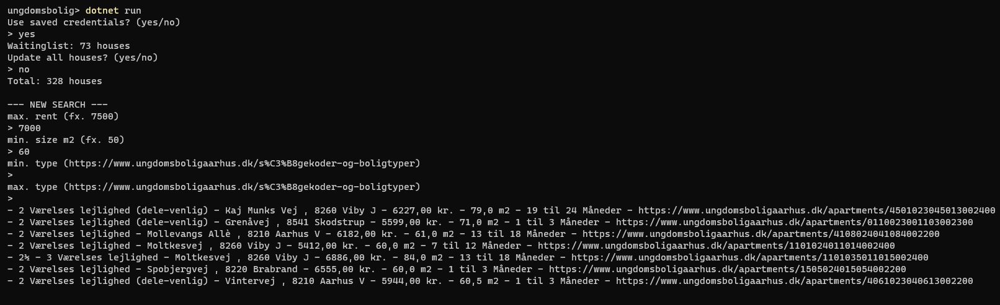

# UngBolig

Search housing on [ungdomsboligaarhus](https://ungdomsboligaarhus.dk) ([studenthousingaarhus](https://studenthousingaarhus.com/user)) by rent, size, or type.

## How to use
- Open terminal and navigate to the folder containing _ungdomsbolig.csproj_
- Run `dotnet run`

