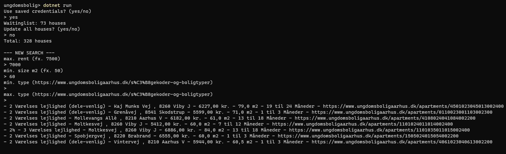
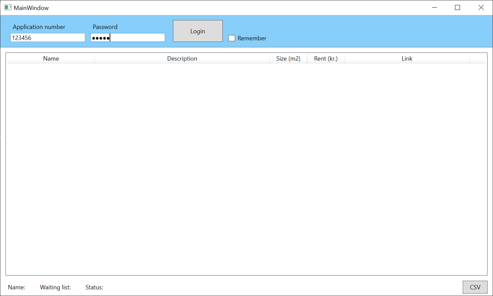
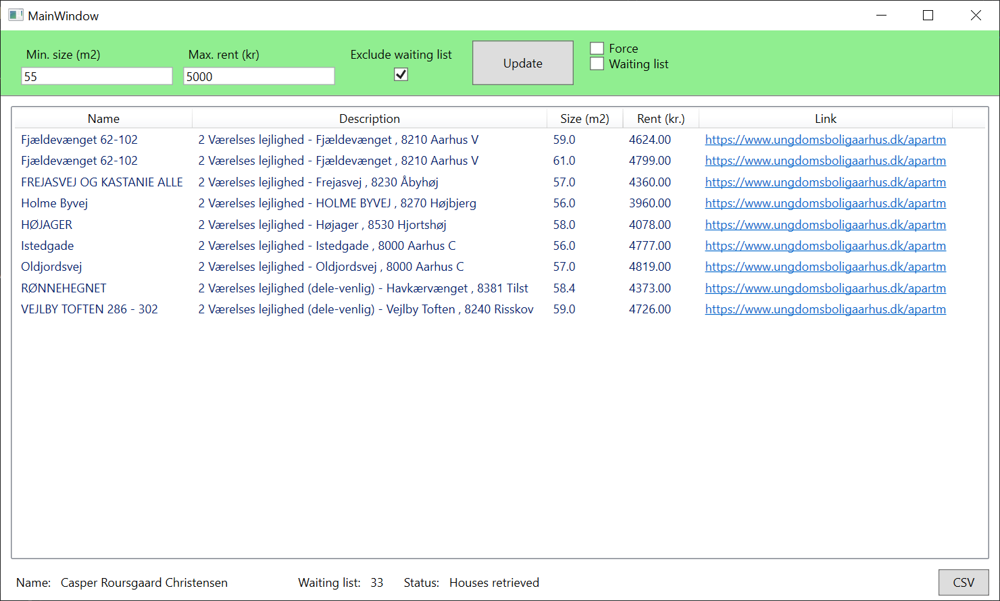

# UngBolig

- Search housing on [ungdomsboligaarhus](https://ungdomsboligaarhus.dk) ([studenthousingaarhus](https://studenthousingaarhus.com/user)) by rent, size, or type.

- Organize your waiting list.

- Export CSV (For Google MyMaps import / Currently only available for WPF)

## Getting started
### Console (Unix/Windows)
- Open terminal and navigate to the _ungdomsbolig_-folder containing _ungdomsbolig.csproj_
- Run `dotnet run`

### WPF (Windows)
- Open terminal and navigate to the _ungdomsbolig.WPF_-folder containing _ungdomsbolig.WPF.csproj_
- Run `dotnet run`

(Alternatively, download and run the [latest release](https://github.com/casrou/ungbolig/releases/latest))

